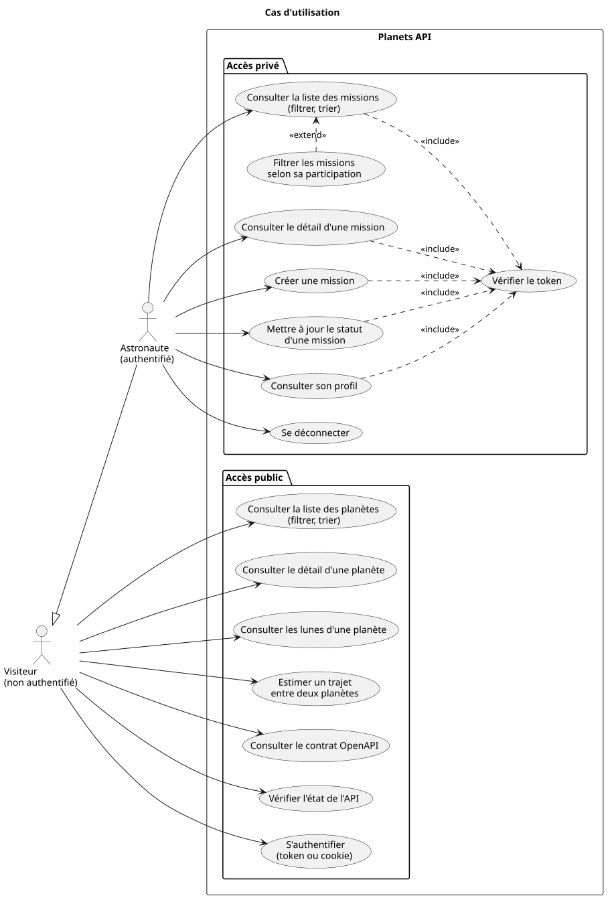

# Documentation de Planets API

Planets API est une API REST pédagogique : elle expose les planètes du système solaire, leurs lunes et les missions spatiales qui les ont étudiées, et sert de support pour illustrer les choix de conception d'une API REST.

Cette documentation explique **pourquoi** l'API est construite ainsi. La référence détaillée de chaque endpoint (paramètres, exemples de réponses) se trouve dans le [README du projet](../README.md) et dans le contrat OpenAPI servi par `GET /openapi.json`.

| Document | Contenu |
| --- | --- |
| [Architecture](architecture.md) | Pile technique, organisation du code, parcours d'une requête, conventions REST (enveloppe, statuts, cache, CORS, validation) |
| [Ressources](ressources.md) | Les ressources exposées, leurs champs, leurs relations et la façon dont chaque relation est traduite en URL |
| [Authentification](authentification.md) | Token JWT, remise par corps ou par cookie, routes privées, filtrage du contenu selon l'utilisateur |

## L'API en bref

| Élément | Choix |
| --- | --- |
| Runtime et framework | [Bun](https://bun.sh) et [Hono](https://hono.dev), en TypeScript |
| Données | En mémoire (aucune base de données) : statiques, sauf les missions, dont la persistance est simulée |
| Format | JSON, avec un champ `success` dans toutes les réponses |
| Routes publiques | `/planets`, les lunes, `/travel-estimation`, `/health`, `/openapi.json` |
| Routes privées | `/missions`, `/auth/me` |
| Authentification | Token JWT (HS256, une heure), transmis par en-tête `Authorization` ou par cookie `httpOnly` |
| Utilisateur | Un seul : `john@doe.com` / `azerty`, rôle `astronaut` |

## Cas d'utilisation



Source : [schemas/cas-utilisation.puml](schemas/cas-utilisation.puml)

Deux acteurs utilisent l'API :

- le **visiteur**, non authentifié, consulte les planètes et leurs lunes, estime un trajet et peut s'authentifier ;
- l'**astronaute**, authentifié, peut faire tout ce que fait le visiteur, et accède en plus aux missions, qu'il peut aussi créer et faire avancer dans leur cycle de vie, et à son profil.

Les cas d'utilisation privés incluent tous la vérification du token. Le filtre selon la participation étend la consultation des missions : c'est une variante facultative de la même requête. La déconnexion n'exige pas de token valide : elle se contente de supprimer le cookie.

## Schémas

Les schémas sont écrits en [PlantUML](https://plantuml.com) dans le dossier [schemas/](schemas/). Chaque fichier `.puml` est accompagné de son rendu `.svg`, affiché dans les documents.

| Schéma | Type | Utilisé dans |
| --- | --- | --- |
| [cas-utilisation.puml](schemas/cas-utilisation.puml) | Diagramme de cas d'utilisation | Ce document |
| [modele-domaine.puml](schemas/modele-domaine.puml) | Diagramme de classes | [Ressources](ressources.md) |
| [architecture.puml](schemas/architecture.puml) | Diagramme de composants | [Architecture](architecture.md) |
| [parcours-requete.puml](schemas/parcours-requete.puml) | Diagramme d'activité | [Architecture](architecture.md) |
| [authentification.puml](schemas/authentification.puml) | Diagramme de séquence | [Authentification](authentification.md) |
| [filtre-utilisateur.puml](schemas/filtre-utilisateur.puml) | Diagramme de séquence | [Authentification](authentification.md) |

Après la modification d'un fichier `.puml`, régénérer les rendus :

```sh
plantuml -tsvg docs/schemas/*.puml
```
