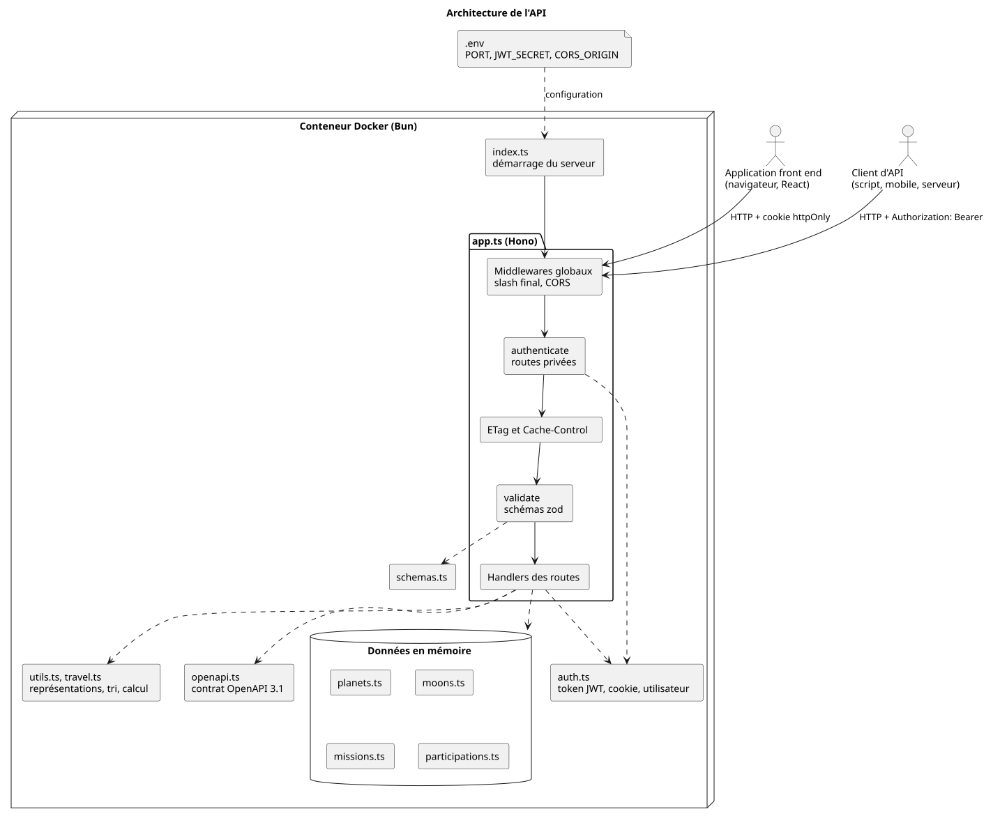
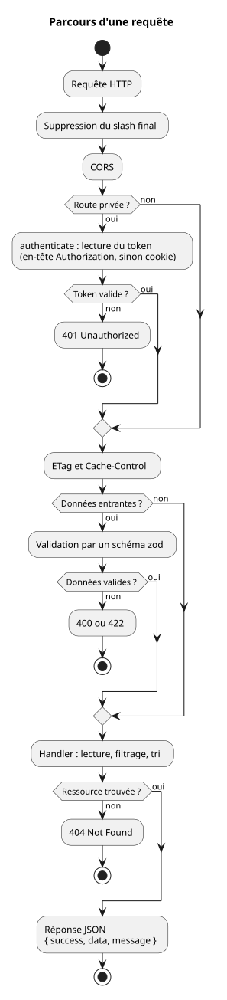

# Architecture

[Retour au sommaire](README.md)

## Pile technique

| Besoin | Choix | Raison |
| --- | --- | --- |
| Exécution | Bun | Exécute TypeScript sans étape de compilation, fournit le lanceur de tests et le hachage de mots de passe |
| Routage HTTP | Hono | Framework minimal, bâti sur les standards du web (`Request`, `Response`), avec des middlewares prêts à l'emploi (CORS, ETag, JWT, cookies) |
| Validation | zod | Un schéma décrit à la fois la forme attendue, les conversions et le type TypeScript qui en résulte |
| Stockage | Tableaux en mémoire | Les données sont fixes ; une base de données n'apporterait rien au propos de l'API |

L'API est **sans état** : aucune session n'est conservée côté serveur. Chaque requête porte tout ce qu'il faut pour être traitée, y compris l'identité de l'utilisateur (dans le token JWT).

## Vue d'ensemble



Source : [schemas/architecture.puml](schemas/architecture.puml)

Deux types de clients appellent l'API : une application front end, qui transporte le token dans un cookie, et un client d'API, qui le transporte dans un en-tête. Tout le reste tient dans un seul processus Bun, sans base de données ni service externe.

## Organisation du code

```
src/
  index.ts           point d'entrée : vérifie la configuration et démarre le serveur
  app.ts             l'application : middlewares et routes
  auth.ts            utilisateur, création et vérification du token, cookie, middleware authenticate
  schemas.ts         schémas zod des données entrantes et fonction validate
  openapi.ts         contrat OpenAPI 3.1
  types.ts           types TypeScript et listes de valeurs autorisées
  utils.ts           passage des données brutes aux représentations exposées, tri
  travel.ts          calcul de l'estimation de trajet
  planets.ts         données : 8 planètes
  moons.ts           données : 22 lunes principales
  missions.ts        données : 18 missions
  participations.ts  données : association utilisateur / mission
tests/
  app.test.ts        tests de l'API
bruno/               collection de requêtes Bruno
docs/                cette documentation
  schemas/           schémas PlantUML (.puml) et leur rendu (.svg)
```

Trois séparations structurent le code :

- **`app.ts` et `index.ts`** : l'application est exportée sans être démarrée. Les tests l'appellent directement (`app.request("/planets")`), sans ouvrir de port réseau.
- **Données et représentations** : les fichiers de données contiennent les objets bruts ; les fonctions de `utils.ts` (`toSummary`, `toDetail`, etc.) construisent ce qui est renvoyé au client. Une même ressource a ainsi deux représentations, résumée dans les listes et complète dans le détail.
- **Listes de valeurs dans `types.ts`** : les valeurs autorisées (`PLANET_TYPES`, `AGENCIES`, `USER_ROLES`, etc.) sont déclarées une seule fois et réutilisées par les types, les schémas de validation et le contrat OpenAPI, qui ne peuvent donc pas diverger.

## Parcours d'une requête

Une requête traverse les middlewares dans l'ordre où ils sont déclarés dans `app.ts` :



Source : [schemas/parcours-requete.puml](schemas/parcours-requete.puml)

1. **Slash final** : `/planets/` est redirigé vers `/planets`, pour qu'une ressource n'ait qu'une seule URL.
2. **CORS** : ouvert à toutes les origines sur les routes publiques, restreint à `CORS_ORIGIN` sur les routes qui acceptent le cookie (voir plus bas).
3. **Authentification**, uniquement sur les routes privées : elle passe en premier, avant la validation et avant la recherche de la ressource. Sans token, une mission inconnue renvoie donc un `401` et non un `404` : l'API ne révèle rien à un client non authentifié.
4. **Cache** : calcul de l'`ETag` et ajout de l'en-tête `Cache-Control`.
5. **Validation** des paramètres de requête ou du corps.
6. **Handler** : lecture des données, filtrage, tri, construction de la réponse.

Deux gestionnaires globaux complètent le tout : une route inconnue renvoie un `404` en JSON, et une erreur inattendue un `500` sans détail technique (l'erreur est journalisée côté serveur).

## Conventions REST

### Nommage des URL

- Les ressources sont désignées par des **noms au pluriel** : `/planets`, `/missions`.
- Les identifiants sont des **mots lisibles** (`earth`, `voyager-2`) plutôt que des nombres, et insensibles à la casse.
- Une opération métier reste nommée par un nom : `/travel-estimation` (une estimation), pas `/estimate-travel`.

### Enveloppe des réponses

Toutes les réponses ont la même forme, ce qui permet à un client de les traiter de façon uniforme :

```json
{ "success": true, "data": { }, "message": "..." }
```

```json
{ "success": false, "error": "Planet not found" }
```

### Liens entre ressources

Chaque représentation porte un objet `links` : son propre lien (`self`) et les liens vers les ressources associées. Le client suit ces liens au lieu de construire les URL lui-même.

```json
"links": { "self": "/planets/earth", "moons": "/planets/earth/moons", "missions": "/missions?planet=earth" }
```

### Statuts HTTP

| Statut | Signification dans l'API |
| --- | --- |
| `200` | Succès, y compris pour une liste vide et pour `POST /travel-estimation` (rien n'est créé, donc pas de `201`) |
| `304` | La version en cache du client est à jour |
| `400` | Requête mal formée : paramètre de requête invalide, JSON illisible, champ manquant ou du mauvais type |
| `401` | Identifiants incorrects, ou token absent, invalide ou expiré |
| `404` | La ressource désignée par l'URL n'existe pas |
| `409` | Valeurs valides isolément mais en conflit entre elles (`from` et `to` identiques) |
| `422` | Corps bien formé, mais une valeur ne peut pas être traitée (planète inconnue, vitesse négative) |
| `500` | Erreur interne |

La distinction entre `400`, `422` et `409` suit une progression : la requête est-elle lisible ? Ses valeurs sont-elles acceptables une à une ? Sont-elles cohérentes entre elles ? Si un corps cumule un problème de forme et une valeur non traitable, c'est le `400` qui l'emporte.

Une planète inconnue donne un `404` dans une URL (`/planets/pluto`) mais un `422` dans un corps de requête : dans le second cas l'URL existe, c'est la donnée envoyée qui est incorrecte.

### Validation des données entrantes

Chaque route qui reçoit des données les fait passer par un schéma zod (`src/schemas.ts`). Le schéma vérifie, mais aussi convertit : `"true"` devient un booléen, `"-diameterKm"` devient `{ field: "diameterKm", descending: true }`. Le handler ne manipule que des données déjà valides et typées.

En cas d'échec, la fonction `validate` répond dans l'enveloppe de l'API et liste tous les champs en cause, pas seulement le premier.

### Filtrage et tri

Les listes se filtrent et se trient par paramètres de requête, combinables : `/planets?hasRings=true&sort=-diameterKm`. Le tri est croissant par défaut, décroissant avec le préfixe `-`. Les champs triables sont limités à une liste explicite.

### Cache HTTP

| Routes | En-têtes | Effet |
| --- | --- | --- |
| `/planets` et lunes | `Cache-Control: public, max-age=3600` et `ETag` | Les données sont statiques et identiques pour tous : navigateurs et proxys peuvent les conserver une heure |
| `/missions` | `Cache-Control: private, no-cache` et `ETag` | Le contenu dépend de l'utilisateur : aucun cache partagé, et le navigateur revalide à chaque fois, ce qui revérifie le token |
| `/auth/*` | `Cache-Control: no-store` | Un token ne doit jamais être stocké par un cache |
| `/travel-estimation`, `/health` | aucun | Réponses non mises en cache |

Avec un `ETag`, le client renvoie l'empreinte de sa copie dans `If-None-Match` ; si elle est à jour, le serveur répond `304` sans corps.

### CORS

| Routes | Origines autorisées | Cookies |
| --- | --- | --- |
| Publiques | toutes (`*`) | non |
| `/auth/*` et `/missions` | celles de la variable `CORS_ORIGIN` | oui (`Access-Control-Allow-Credentials: true`) |

Cette séparation n'est pas un choix de confort : un navigateur refuse d'envoyer ou de recevoir un cookie si le serveur répond avec l'origine `*`. Les routes qui acceptent le cookie doivent donc nommer explicitement les origines autorisées.

## Contrat OpenAPI

`GET /openapi.json` renvoie la description complète de l'API au format OpenAPI 3.1 : routes, paramètres, schémas des réponses, modes d'authentification. Le document est écrit à la main dans `src/openapi.ts` ; un test vérifie que la liste des routes décrites correspond à celle attendue.

## Configuration et déploiement

| Variable | Rôle |
| --- | --- |
| `PORT` | Port d'écoute dans le conteneur |
| `EXTERNAL_PORT` | Port exposé sur la machine hôte |
| `JWT_SECRET` | Clé de signature des tokens ; le serveur refuse de démarrer si elle est absente |
| `CORS_ORIGIN` | Origines autorisées à utiliser le cookie, séparées par des virgules |
| `NODE_ENV` | À `production`, le cookie d'authentification reçoit l'attribut `Secure` |

L'API se lance avec `docker compose up --build` ou, en développement, avec `bun run dev`. L'image Docker n'embarque ni les tests ni la collection Bruno, et le conteneur est surveillé par un appel régulier à `/health`.

## Tests

- **Tests automatisés** (`bun test`) : ils couvrent chaque route, les cas d'erreur, le cache, le CORS et l'authentification.
- **Collection Bruno** (`bruno/`) : les mêmes scénarios, exécutables à la main ou en ligne de commande contre un serveur lancé. Le dossier `Auth` s'exécute avant `Missions`, dont les requêtes réutilisent le token obtenu.
