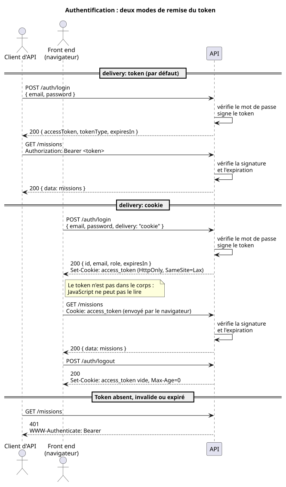
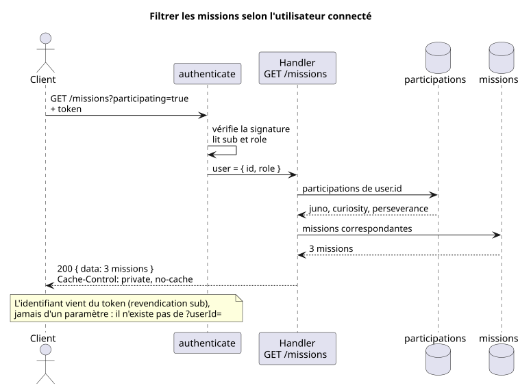

# Authentification

[Retour au sommaire](README.md)

## Principe

L'API est sans état : elle ne conserve aucune session. À la connexion, elle remet au client un **token JWT** signé ; le client le renvoie à chaque requête, et l'API en vérifie la signature pour savoir qui l'appelle.



Source : [schemas/authentification.puml](schemas/authentification.puml)

L'API ne connaît qu'un utilisateur : `john@doe.com` / `azerty`.

## Le token

Le token est signé en HS256 avec la clé `JWT_SECRET` et expire au bout d'une heure.

```json
{
  "sub": "5f0f4aca-7368-4b38-b2fe-a2ed7925441b",
  "role": "astronaut",
  "iat": 1791100800,
  "exp": 1791104400
}
```

| Revendication | Contenu |
| --- | --- |
| `sub` | Identifiant de l'utilisateur (UUID). C'est la revendication standard pour désigner le sujet du token |
| `role` | Rôle de l'utilisateur |
| `iat` | Date d'émission |
| `exp` | Date d'expiration |

### Pourquoi l'email n'y figure pas

Un JWT est **signé, pas chiffré** : son contenu est lisible par quiconque le détient, il suffit de le décoder. La signature garantit seulement qu'il n'a pas été modifié.

Le token ne transporte donc que le strict nécessaire, conformément au principe de minimisation du RGPD : un identifiant pseudonyme pour reconnaître l'utilisateur, et son rôle pour décider de ses droits. L'email, directement identifiant, est relu côté serveur à partir de l'id lorsqu'il est utile (`GET /auth/me`).

## Se connecter : un endpoint, deux modes de remise

`POST /auth/login` reçoit l'email, le mot de passe et un champ optionnel `delivery` qui choisit la façon dont le token est remis.

| `delivery` | Emplacement du token | Client visé | Renvoi du token |
| --- | --- | --- | --- |
| `token` (par défaut) | dans le corps de la réponse | un client d'API : script, application mobile, autre serveur | l'en-tête `Authorization: Bearer <token>` |
| `cookie` | dans le cookie `access_token` | une application front end dans un navigateur | le navigateur, automatiquement |

Les deux modes existent parce que les deux types de clients n'ont pas les mêmes risques. Un navigateur exécute du JavaScript venu de nombreuses sources : si le token y est accessible, un script malveillant injecté dans la page (attaque XSS) peut le voler. Le cookie `httpOnly` met le token hors de portée de JavaScript.

En mode `cookie`, le token est donc **absent du corps** de la réponse : l'y inclure annulerait la protection.

### Attributs du cookie

| Attribut | Effet |
| --- | --- |
| `HttpOnly` | Le cookie est illisible en JavaScript |
| `SameSite=Lax` | Le navigateur ne joint pas le cookie aux requêtes `POST` venant d'un autre site, ce qui protège des attaques CSRF |
| `Secure` | Le cookie n'est envoyé qu'en HTTPS ; ajouté lorsque `NODE_ENV=production` |
| `Max-Age=3600` | Le cookie expire en même temps que le token |

Côté front end, deux conditions sont nécessaires : appeler l'API avec `credentials: "include"`, et faire figurer l'origine du front dans `CORS_ORIGIN`.

### Se déconnecter

`POST /auth/logout` supprime le cookie. Cette route est nécessaire parce que JavaScript ne peut pas supprimer un cookie `httpOnly` : seul le serveur le peut. En mode `token`, il suffit que le client oublie le token.

Dans les deux cas, le token lui-même reste valide jusqu'à son expiration : l'API ne tient pas de liste des tokens révoqués. C'est la contrepartie de l'absence d'état, et la raison de la durée de vie courte.

### Erreurs de connexion

| Statut | Cas |
| --- | --- |
| `400` | Champ manquant ou du mauvais type |
| `401` | Identifiants incorrects |
| `422` | Valeur de `delivery` inconnue |

Le message du `401` est le même pour un email inconnu et pour un mot de passe erroné, et le mot de passe est vérifié dans les deux cas : ni le message ni le temps de réponse ne révèlent si un email existe.

## Routes privées

Le middleware `authenticate` (`src/auth.ts`) protège les routes `/missions` et `/auth/me`.

1. Il cherche le token dans l'en-tête `Authorization: Bearer`, à défaut dans le cookie `access_token`. Si les deux sont présents, l'en-tête l'emporte.
2. Il vérifie la signature et la date d'expiration.
3. Il vérifie que le token porte un identifiant et un rôle connu.
4. Il met l'utilisateur du token (`id` et `role`) à disposition de la route.

En cas d'échec, la réponse est un `401` accompagné de l'en-tête `WWW-Authenticate: Bearer`.

Protéger une nouvelle route tient en une ligne :

```ts
app.use("/missions/*", authenticate);
```

Le rôle est transporté et vérifié, mais aucune route ne restreint aujourd'hui l'accès selon sa valeur : toute personne authentifiée accède aux routes privées.

## Filtrer le contenu selon l'utilisateur

`GET /missions?participating=true` ne renvoie que les missions auxquelles participe l'utilisateur connecté. L'API retrouve cet utilisateur grâce à la revendication `sub` du token, puis consulte l'association utilisateur / mission.



Source : [schemas/filtre-utilisateur.puml](schemas/filtre-utilisateur.puml)

Le point important est ce qui **n'existe pas** : il n'y a pas de paramètre `?userId=...`.

- Si l'identifiant venait d'un paramètre, n'importe quel utilisateur connecté pourrait le remplacer par celui d'un autre et consulter ses données.
- Le token, lui, ne peut pas être modifié par le client : changer le `sub` invalide la signature.

La règle générale : **l'identité vient toujours du token, jamais d'une donnée fournie par le client.**

Deux conséquences sur le reste de l'API :

- **Une même URL renvoie un contenu différent selon l'utilisateur.** Les routes des missions sont donc en `Cache-Control: private` : un cache partagé pourrait sinon servir à un utilisateur la réponse destinée à un autre.
- **Un utilisateur sans participation obtient une liste vide**, avec un `200`, et non une erreur.
