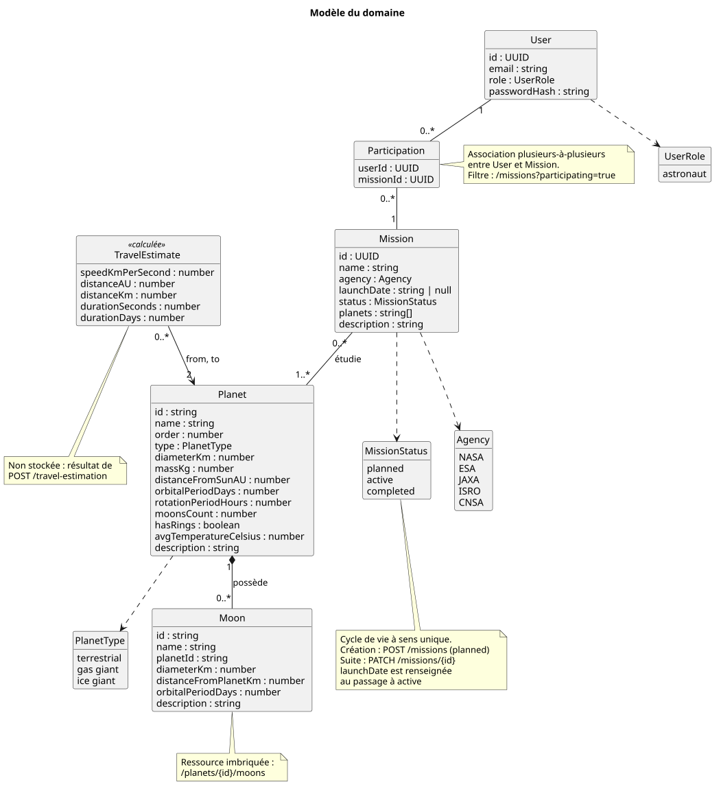

# Ressources et relations

[Retour au sommaire](README.md)

## Vue d'ensemble

Source : [schemas/modele-domaine.puml](schemas/modele-domaine.puml)

| Ressource | Nombre | Accès | Routes |
| --- | --- | --- | --- |
| Planète | 8 | public | `/planets`, `/planets/{id}` |
| Lune | 22 | public | `/planets/{id}/moons`, `/planets/{id}/moons/{moonId}` |
| Mission | 18 au démarrage | privé | `/missions`, `POST /missions`, `/missions/{id}`, `PATCH /missions/{id}` |
| Utilisateur | 1 | privé | `/auth/me` |
| Estimation de trajet | calculée | public | `POST /travel-estimation` |

Chaque type de relation est traduit différemment dans les URL. C'est le principal choix de conception de cette API.

| Relation | Type | Traduction |
| --- | --- | --- |
| Planète / Lune | un-à-plusieurs, la lune dépend de la planète | Ressource imbriquée : `/planets/{id}/moons` |
| Planète / Mission | plusieurs-à-plusieurs | Collection de premier niveau et filtre : `/missions?planet=saturn` |
| Utilisateur / Mission | plusieurs-à-plusieurs, dépend de l'utilisateur connecté | Filtre sans identifiant : `/missions?participating=true` |

## Planète

Ressource centrale de l'API. Les 8 planètes ont un identifiant lisible (de `mercury` à `neptune`).

| Champ | Type | Description |
| --- | --- | --- |
| `id` | string | Identifiant, en minuscules |
| `name` | string | Nom |
| `order` | number | Position à partir du Soleil |
| `type` | string | `terrestrial`, `gas giant` ou `ice giant` |
| `diameterKm` | number | Diamètre |
| `massKg` | number | Masse |
| `distanceFromSunAU` | number | Distance moyenne au Soleil, en unités astronomiques |
| `orbitalPeriodDays` | number | Durée d'une révolution |
| `rotationPeriodHours` | number | Durée d'une rotation |
| `moonsCount` | number | Nombre total de lunes connues |
| `hasRings` | boolean | Présence d'anneaux |
| `avgTemperatureCelsius` | number | Température moyenne |
| `description` | string | Description |

Deux représentations existent :

- **résumée**, dans la liste : `id`, `name`, `order`, `type` et le lien `self` ;
- **complète**, dans le détail : tous les champs, et les liens vers ses lunes et ses missions.

La liste reste ainsi légère, et le client va chercher le détail de ce qui l'intéresse en suivant le lien `self`.

## Lune

Une lune n'existe que rattachée à sa planète : c'est une **ressource imbriquée**.

| Champ | Type | Description |
| --- | --- | --- |
| `id` | string | Identifiant, unique pour une planète donnée |
| `name` | string | Nom |
| `planetId` | string | Planète autour de laquelle elle orbite |
| `diameterKm` | number | Diamètre |
| `distanceFromPlanetKm` | number | Distance moyenne à la planète |
| `orbitalPeriodDays` | number | Durée d'une révolution |
| `description` | string | Description |

Conséquences de l'imbrication :

- L'URL d'une lune contient sa planète : `/planets/jupiter/moons/europa`. Il n'existe pas de route `/moons`.
- Demander une lune sous la mauvaise planète (`/planets/mars/moons/europa`) renvoie un `404` : l'URL décrit une appartenance qui n'existe pas.
- Une planète sans lune renvoie un `200` avec une liste vide, pas un `404` : la collection existe, elle est seulement vide.
- Seules les lunes principales sont listées. Le champ `moonsCount` de la planète reste le total réel, les deux nombres peuvent donc différer.

## Mission

Une mission peut étudier plusieurs planètes, et une planète est étudiée par plusieurs missions. Imbriquer les missions sous une planète obligerait à choisir une planète "propriétaire" et donnerait plusieurs URL à une même mission. Les missions forment donc une **collection de premier niveau**, et la relation s'exprime par un filtre.

| Champ | Type | Description |
| --- | --- | --- |
| `id` | UUID | Identifiant (`0c262d45-6bf0-427a-940d-6b02827a0e15`) |
| `name` | string | Nom |
| `agency` | string | Agence principale : `NASA`, `ESA`, `JAXA`, `ISRO` ou `CNSA` |
| `launchDate` | string ou `null` | Date de lancement, au format `AAAA-MM-JJ` ; `null` tant que la mission est `planned` |
| `status` | string | `planned`, `active` ou `completed` |
| `planets` | tableau | Planètes étudiées, dans l'ordre de visite |
| `description` | string | Description |

- Dans les données, `planets` est une liste d'identifiants. Dans le détail d'une mission, chaque planète est renvoyée sous forme de **référence** : `id`, `name` et lien `self`, ce qui évite au client une requête par planète pour afficher leurs noms.
- La relation se parcourt dans les deux sens : le détail d'une planète porte le lien `/missions?planet={id}`, le détail d'une mission liste ses planètes.
- Contrairement aux planètes et aux lunes, dont l'identifiant est un mot lisible, une mission est identifiée par un **UUID** : les missions peuvent être créées par les clients, et un identifiant généré ne dépend ni du nom ni des missions déjà présentes.
- Les routes des missions sont **privées** (voir [Authentification](authentification.md)).

### Création

La mission est la seule ressource que l'API permet de créer et de modifier. `POST /missions` ajoute une mission à la collection.

- Le client envoie `name`, `agency`, `planets` et `description`. Il ne choisit ni l'identifiant, un UUID généré par le serveur, ni le statut, toujours `planned`, ni la date de lancement, encore inconnue (`null`).
- La réponse est un `201` : elle porte l'URL de la nouvelle mission dans l'en-tête `Location` et sa représentation complète dans le corps.
- Un UUID est unique sans que le serveur ait à consulter les missions existantes : la création ne peut pas entrer en conflit avec une autre mission, et deux missions peuvent porter le même nom.

### Cycle de vie

`PATCH /missions/{id}` met à jour le statut, avec le corps `{ "status": "active" }`. Le verbe est `PATCH` et non `PUT` parce que la mise à jour est partielle : le client n'envoie que le champ modifié, pas la mission entière.

| Statut actuel | Statut accepté |
| --- | --- |
| `planned` | `active` |
| `active` | `completed` |
| `completed` | aucun |

La date de lancement dépend du statut : elle n'est renseignée que lorsque la mission passe à `active`. Le serveur y inscrit alors la date du jour, le client ne l'envoie pas. Elle est conservée quand la mission passe à `completed`.

Le cycle est à sens unique. Un statut qui n'est pas le suivant renvoie un `409` : la valeur est valide, mais en conflit avec l'état actuel de la mission. Un statut inconnu renvoie un `422`.

### Persistance simulée

L'API n'a pas de base de données. La liste des missions (`src/missions.ts`) en tient lieu : une mission créée y est ajoutée, un changement de statut y est appliqué. Les autres routes voient donc aussitôt le résultat (liste, filtres, détail), mais tout est perdu au redémarrage du serveur, qui repart des 18 missions d'origine.

## Utilisateur et participation

L'API ne connaît qu'un utilisateur, défini dans `src/auth.ts`.

| Champ | Type | Description |
| --- | --- | --- |
| `id` | UUID | Identifiant |
| `email` | string | `john@doe.com` |
| `role` | string | `astronaut` |

Le mot de passe n'est conservé que sous forme d'empreinte argon2id et n'apparaît dans aucune réponse.

La **participation** associe un utilisateur à une mission (`src/participations.ts`, paires `userId` / `missionId`). John Doe participe aux missions Juno, Curiosity et Perseverance.

Cette association n'a pas de route propre. Elle s'exprime par le filtre `participating` de `/missions` :

| Requête | Résultat |
| --- | --- |
| `/missions?participating=true` | Les missions de l'utilisateur connecté |
| `/missions?participating=false` | Toutes les autres |

L'utilisateur concerné n'est jamais désigné dans l'URL : il est lu dans le token. Ce point est détaillé dans [Authentification](authentification.md#filtrer-le-contenu-selon-lutilisateur).

## Estimation de trajet

`POST /travel-estimation` n'est pas une ressource stockée mais une **opération métier** : elle calcule la distance entre deux planètes et la durée du trajet à vitesse constante.

- Le verbe est `POST` parce que l'opération reçoit ses paramètres dans un corps de requête.
- Rien n'est créé : la réponse est un `200` sans en-tête `Location`, et elle n'est pas mise en cache.
- Le résultat renvoie les deux planètes sous forme de références, avec leur lien.
- Le modèle est volontairement simplifié : distance en ligne droite entre les deux orbites au plus proche, à partir des distances moyennes au Soleil.
